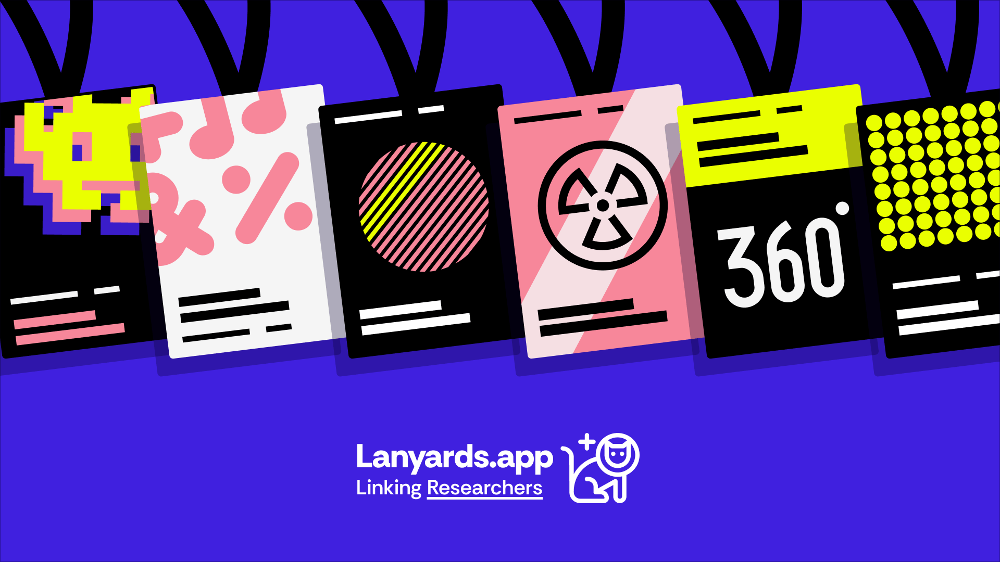

A single curated link for Academic Researchers that aggregates your complete scholarly presence—publications, talks, affiliations, and social profiles—without re-keying info or juggling multiple scattered accounts.

## Problem

Researchers face a visibility paradox: career progression demands comprehensive online presence, but maintaining it is administratively overwhelming.

- Your work is scattered: ORCID for formal publications, ResearchGate for networking, personal website for informal work, Twitter for visibility, conference sites for talks
- Each platform needs manual updates and becomes outdated
- Informal work (preprints, datasets, ongoing projects, social engagement) doesn't fit existing academic infrastructure
- Discovery happens through social connections and informal channels, but formal profiles miss this entirely
- You need different links for different contexts (email signatures, conference bios, grant applications)

ORCID profiles serves institutional needs brilliantly but doesn't capture how researchers actually discover and connect with each other's work.

There's no single place that represents your complete, current scholarly identity.

## A Social Solution

Lanyards is your link in bio for research—one maintained URL that automatically pulls together everything that matters.

- Auto-ingestion: Connect ORCID, Google Scholar, Dimensions—publications appear automatically
- Informal work: Add preprints, datasets, code, talks, media that formal systems miss
- Complete social presence: All your academic and social profiles in one place
- Zero maintenance overhead: Update once (or let it auto-update), share everywhere
- Your presentation, your control: Pin important work, organise by collections, hide what's not relevant
- Built on AT Protocol: Decentralised, open, yours—no platform lock-in

### Benefits

- Share one URL in all your email signatures, conference bios, grant applications, social profiles...
- New connections and collaborators see the full scope of your work immediately
- Informal contributions get the visibility they deserve
- Your profile stays current without constant manual updates
- You control the narrative: what's featured, what's organised, what's visible

## Why does this matter?

### For researchers

Less administrative burden, better visibility, complete professional representation

### For the community

Better discovery of relevant work, including the informal contributions that drive real connections

### For the ecosystem

Open, decentralised infrastructure that serves researchers rather than institutions

